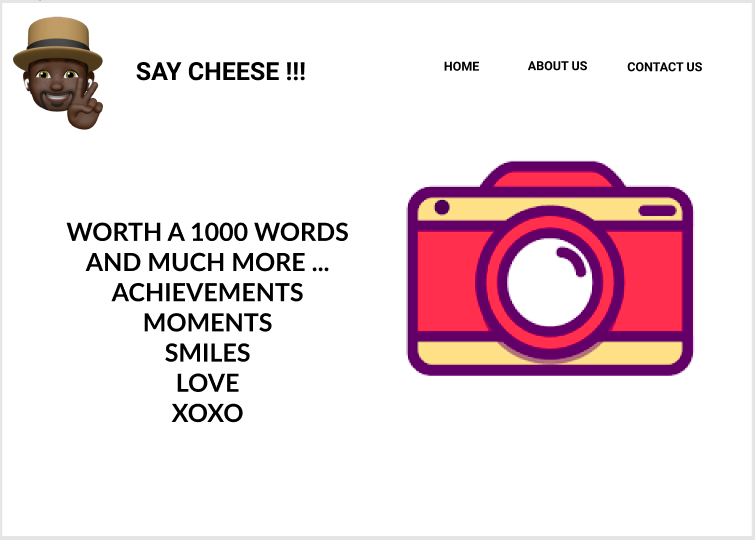
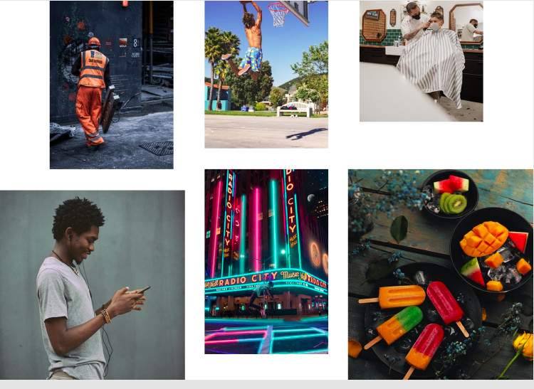
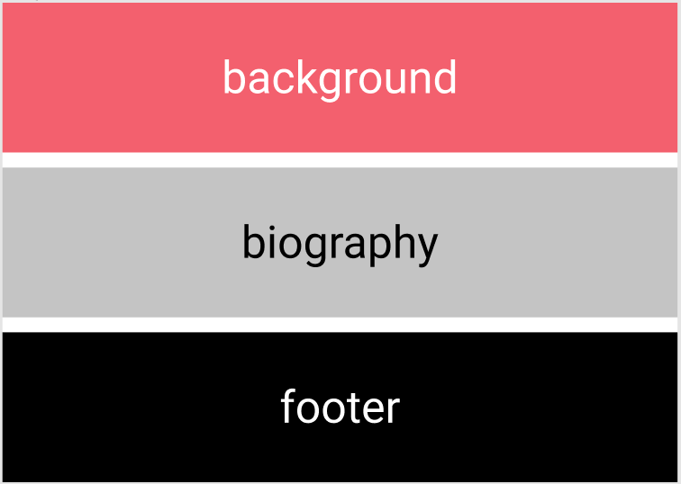

# Photography Website

   

To view the designs in figma, just click the giant figma logo.

This is a Photography website powered by only HTML and CSS that shows pictures in an elegant design.

## Built with

- [HTML](https://html.com) - The language in which most websites are written. HTML is used to create pages and make them functional.
- [CSS](https://css-tricks.com) - Used to design and make HTML elements look visual pleasing and also adds some animations.
- [imgur](https://tevinotieno.imgur.com/all/?third_party=1) - Used to store the images so that they can be linked in the website.

## Bugs

imgmur when post picture it goes to hidden state thefore when linked they do not display properly.
this was solve by having to download and manage the picture in a file the img file.

## License

>You can check out the full license [here](https://github.com/IgorAntun/node-chat/blob/master/LICENSE)

This project is licensed under the terms of the **MIT** license.
